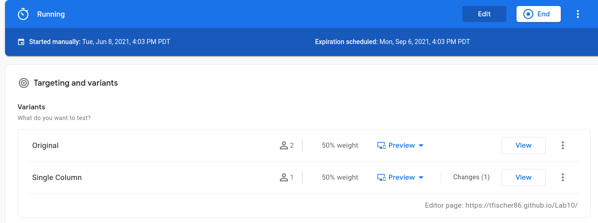
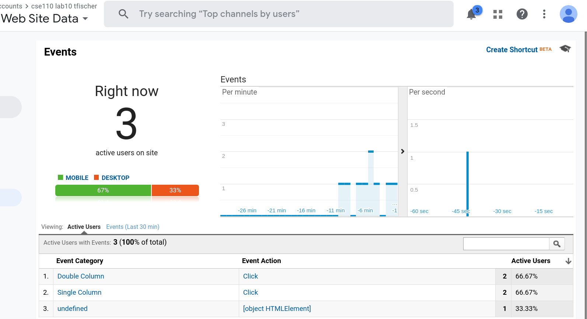
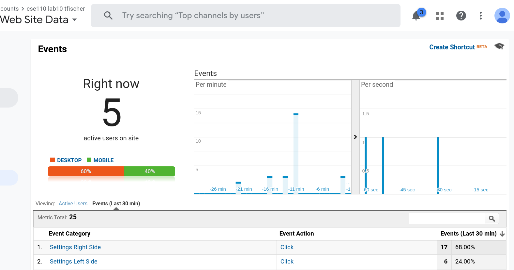

# Lab 10

## Author: Thomas Fischer

[Roadmap and Feature Requests](https://cse110-lab10-tfischer86.canny.io/)

### Pages link:

[https://tfischer86.github.io/Lab10/](https://tfischer86.github.io/Lab10)

fyi: Google Optimize stopped the first experience after I started the second one

[https://tfischer86.github.io/Lab10/secondOptimize.html](https://tfischer86.github.io/Lab10/secondOptimize.html) (the router takes you back to the first page)

## Screenshots

### First A/B

There were two users from Pakistan for a few minutes but I didnt have the A / B test running. Might have given some real data lol idk

### Second Feature

Moved the settings to the left side of the header, to see which side gets clicked more often. But in the fake a / b test I used mobile and it was easier to tap the icon on the right side.

